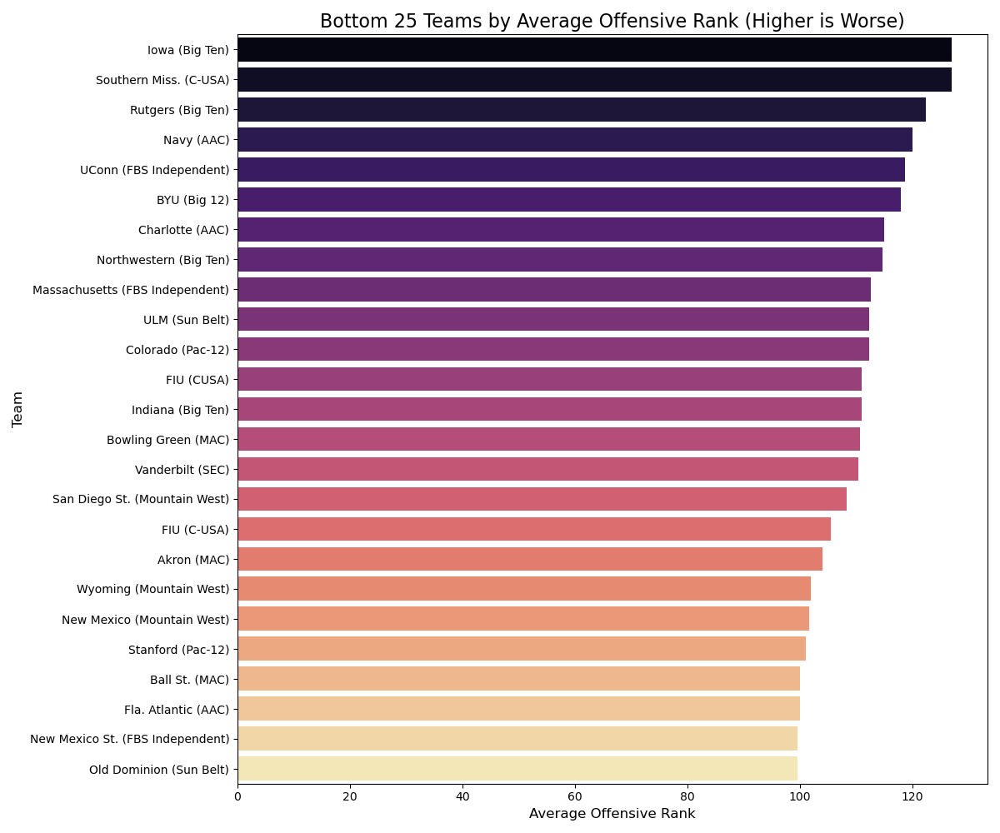
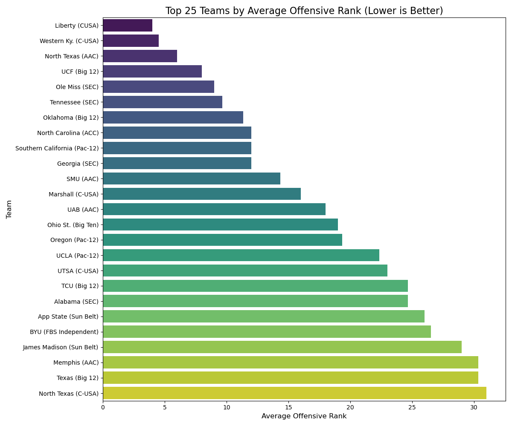
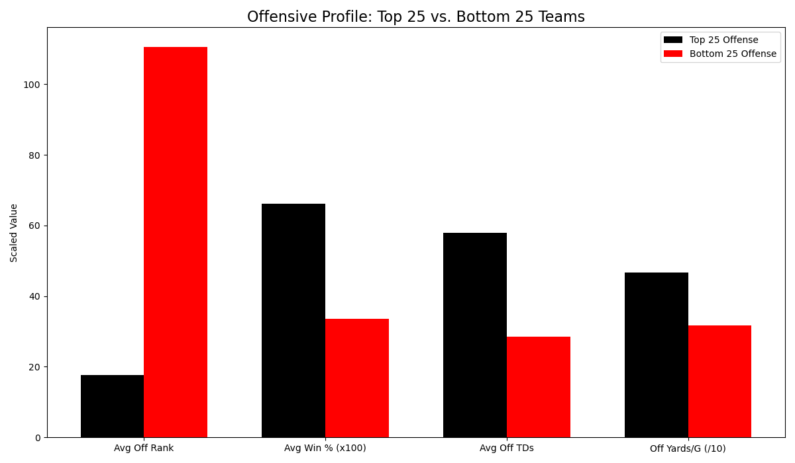
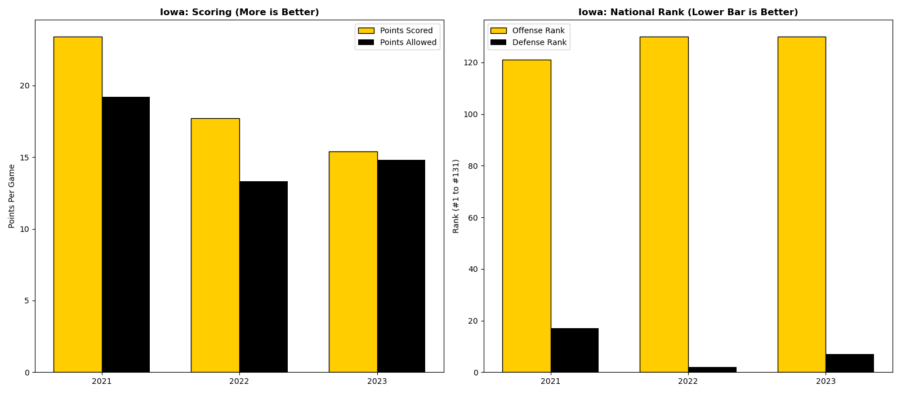
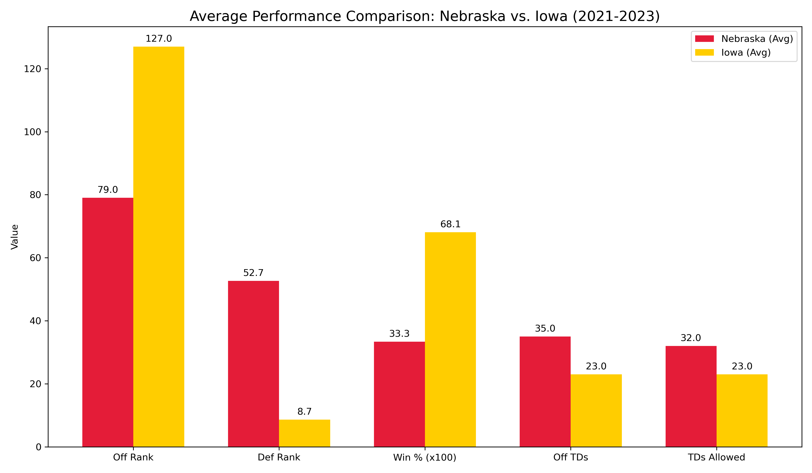

# CollegeFootballProject
https://www.kaggle.com/datasets/jeffgallini/college-football-team-stats-2019?select=cfb23.csv  
  
# Overview  
## What stats normally win in college football?  
## How important is offense in College Football?  
## Is offense all that’s important?  
## Are there any teams that win differently?
#### College football is comprised of hundreds of stats. Using heat maps I found the correlation between certain stats and winning. As most of you guessed scoring more points and playing better defense is a surefire way to win more games. However a few things might standout to you as they did me. For instance college football the OFF rank is a slightly above average negative coorelation. Youd probably expect it to be a very strong negative coorelation. Lets take a look below.  
  
### So now that we've taken a look at the heatmap lets take a look at what the top 25 and bottom 25 offenses are, and what they do really well or do poorly.  
  

  
### There's not a wholt lot of surprise there we see top offenses score more touchdownss, gain more yards and average more offensive yards per game. But what if your team doesn't score that much? What if you are the exception to the rule?
### Audience, lets meet the Exception. Iowa is consistantly ranked at the bottom in terms of offense with their highest ranking in the last three years being 121. Yet they still average more wins per season than average. They are the reason we see our Off rank and Win PCT not correlated stronger.  

 
### A team like Iowa is impressive when we compare them to a team like Nebraska. Nebraska had a good defense and better offensive statistics every year. But Iowas "steel curtain' of a defense was so elite they won over double the amount of games as Nebraska in the last three years. You'd think Nebraska being good not great in a every category would win more games than a team like Iowa that is terrible in one and elite in another.  

